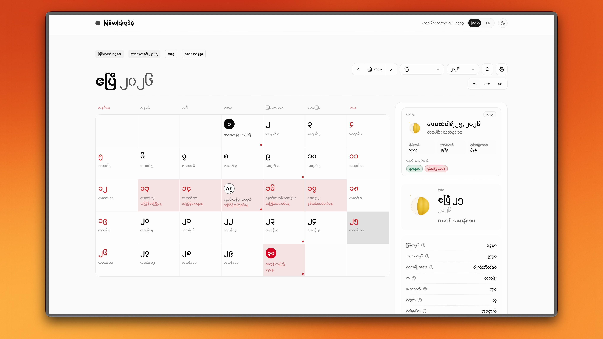
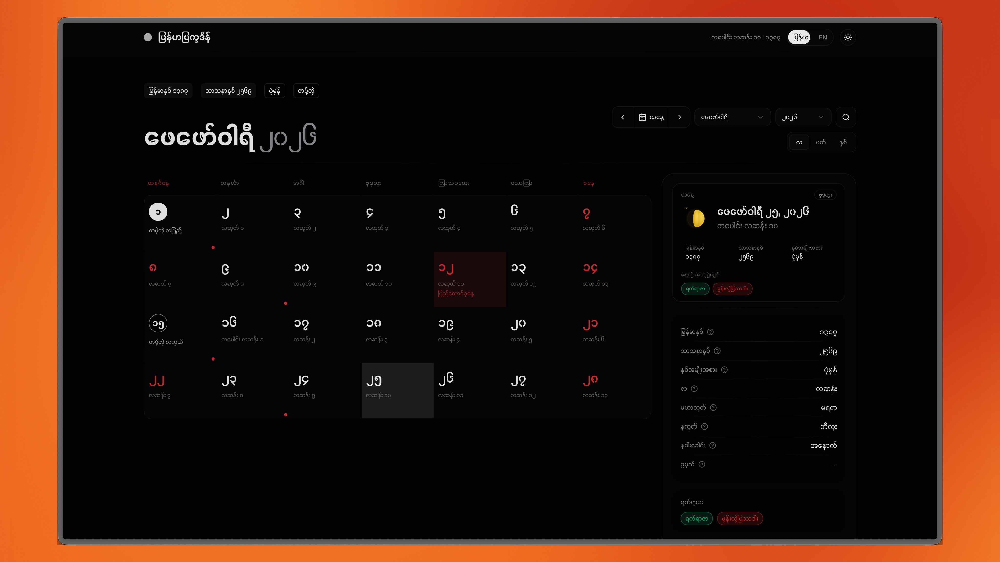
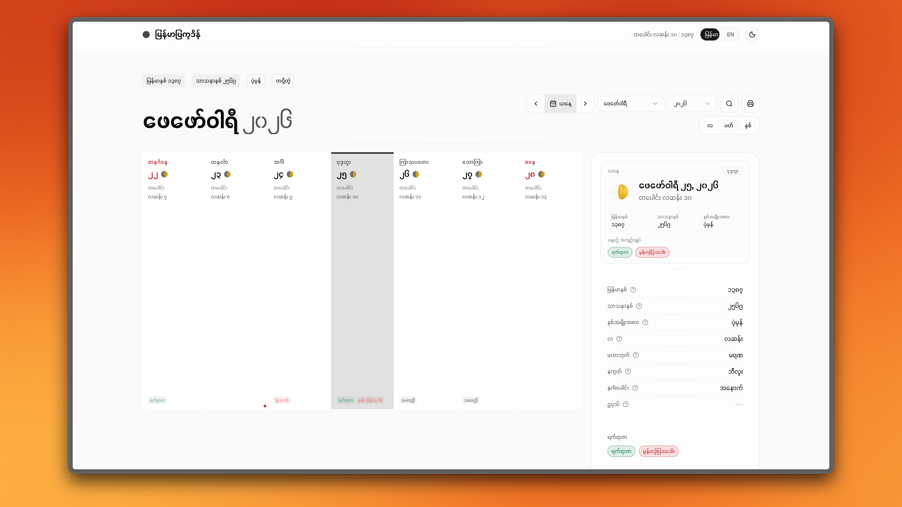
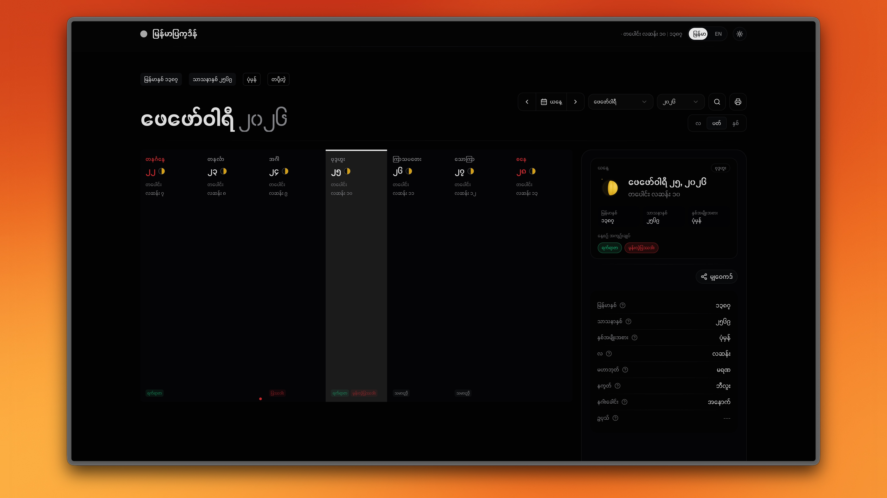
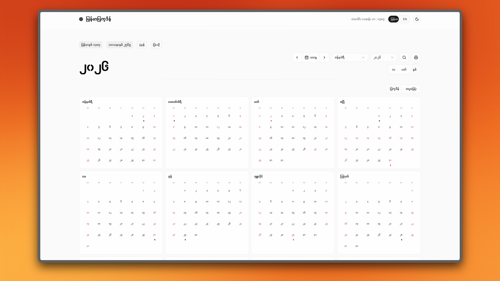
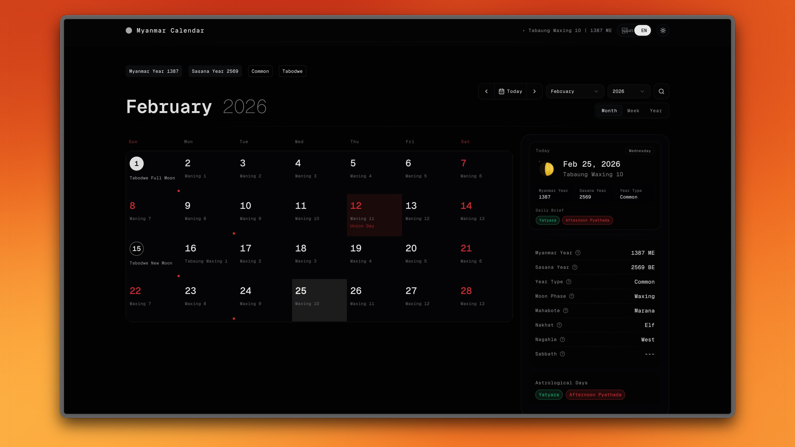

<div align="center">

# mmcal

**A modern, interactive Myanmar (Burmese) calendar**

Myanmar calendar with moon phases, traditional holidays, and astrological days — built for the web.

[](LICENSE)
[](https://react.dev)
[](https://www.typescriptlang.org)
[](https://tailwindcss.com)

</div>

---

## Screenshots

### Myanmar (MM)







### English (EN)



---

## Features

- **Month / Week / Year views** — navigate with keyboard shortcuts or swipe
- **Moon phases** — full moon, new moon, waxing, and waning displayed on every cell
- **Myanmar holidays** — government holidays, traditional festivals, and notable days
- **Astrological days** — yatyaza, pyathada, sabbath, mahabote, nakhat, and nagahle
- **Bilingual** — full Myanmar and English interface with one-click toggle
- **Dark mode** — system-aware with manual override
- **Command palette** — `Cmd+K` to jump to any date or switch views
- **Keyboard navigation** — arrow keys, `T` for today, `M`/`W`/`Y` for views
- **PWA** — installable, works offline
- **Responsive** — optimized layouts for mobile, tablet, and desktop

## Tech Stack

| Category | Technology |
|----------|------------|
| Framework | [React 19](https://react.dev) + [TypeScript](https://typescriptlang.org) |
| Styling | [Tailwind CSS 4](https://tailwindcss.com) |
| Animations | [Framer Motion](https://motion.dev) |
| Components | [Radix UI](https://radix-ui.com) + [shadcn/ui](https://ui.shadcn.com) |
| Command Palette | [cmdk](https://cmdk.paco.me) |
| Build | [Vite](https://vite.dev) |
| Calendar Algorithm | Based on [Cool Emerald's algorithm](https://cool-emerald.blogspot.com/2013/06/algorithm-program-and-calculation-of.html) |

## Getting Started

```bash
# Clone the repository
git clone https://github.com/khzaw/mmcal.git
cd mmcal

# Install dependencies
pnpm install

# Start development server
pnpm dev

# Run tests
pnpm test:run

# Build for production
pnpm build
```

## Keyboard Shortcuts

| Key | Action |
|-----|--------|
| `←` `→` | Previous / Next (month, week, or year) |
| `T` | Go to today |
| `M` | Month view |
| `W` | Week view |
| `Y` | Year view |
| `Cmd+K` | Open command palette |

## Algorithm

The calendar calculations are based on the [Myanmar Calendar Algorithm](https://cool-emerald.blogspot.com/2013/06/algorithm-program-and-calculation-of.html) by Cool Emerald. It handles:

- Gregorian ↔ Julian Day Number ↔ Myanmar date conversions
- Moon phase calculations (full moon, new moon, waxing, waning)
- Traditional holiday and astrological day lookups
- Sabbath day calculations
- Year type classification (common, little watat, big watat)

## Author

**Kaung Htet** — [@khzaw](https://github.com/khzaw)

## License

MIT
